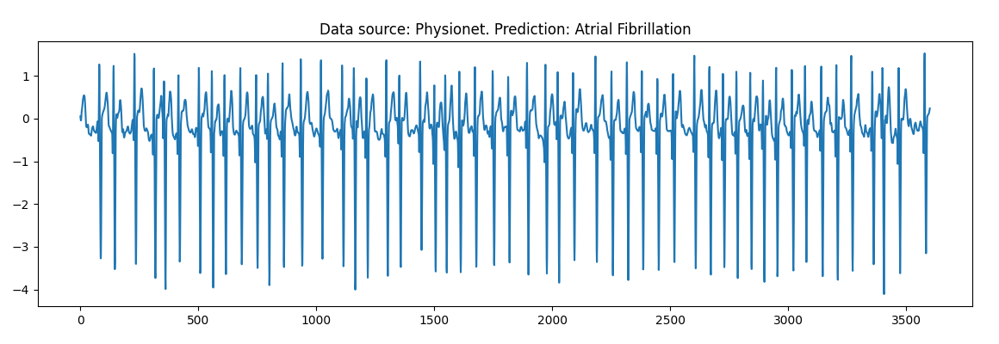
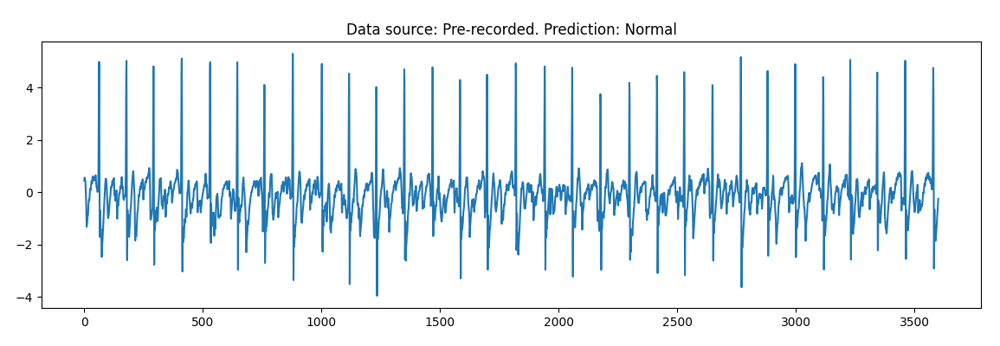

# To Beat Or Not To Beat — Machine Learning Atrial Fibrillation Detection 

Atrial Fibrillation (AF) is the most common serious heart arrthymia, affecting around 30 million people worldwide. It occurs when there are irregularities in the electrical wave the generates a heartbeat, creating misfirings of the upper, atrial chambers which receive blood from the body and lungs. Regular blood transport is disrupted creating vortices which reduce the efficiency of the heart and can create clots. People with AF have a 4 times higher risk of mortality and 5 times higher risk of stroke than the normal population. With this program and a Polar H10 Heart rate monitor you can assess your risk of atrial fibrillation from a 60 second recording.

This is an implementation of the paper Multiscaled fusion of deep convolutional neural networks for screening atrial fibrillation from single lead short ECG recordings. IEEE journal of biomedical and health informatics, 22(6), 1744-1753, Fan, X., Yao, Q., Cai, Y., Miao, F., Sun, F., & Li, Y. (2018). A convolutional neural network is trained as a binary classifier to detect cases of atrial fibrillation using the Physionet Computing in Cardiology Challenge 2017 (https://physionet.org/content/challenge-2017/1.0.0/).





## Setup & Usage

### Inference
There are three options for inference using a pre-trained model in Inference.ipynb: 1) record ECG from a Polar H10 HR monitor, 2) load pre-recorded ECG data, 3) load a sample from the Physionet dataset.

#### 1. Polar H10 Inference
- Put on the Polar H10 chest strap
- Run the first cell in Inference.ipynb, which connects to the Polar H10 via Bluetooth and takes a 60 second ECG recording
- Run the last cell, which loads the model, runs inference, and displays the results

#### 2. Pre-recorded ECG Inference
- Uploaded a pre-recorded ECG .edf file into the data directory. This can be recorded for example with the "Polar H10 ECG Analysis App" on the Google Play Store
- Run the second cell in Inference.ipynb, which loads this file and preprocesses the data
- Run the last cell, to run inference

#### 3. Physionet dataset
- Run the third cell in Inference.ipynb, which loads a random sample from the Physionet database and preprocesses the data
- Run the last cell to make a prediction

### Training
To train the network

``` 
    pip install -r requirements.txt 
    python3 training.py
```
The default model is a two-stream CNN, where each stream has 13 conv layers and 5 max pooling. The two streams are concatenated followed by 3 fully connected layers. In the first stream the kernel size in all layers is 3, in the second stream the kernel sizes of the first 4 layers is set by the parameter `STREAM2_SIZE`, as either 3, 5, 7, or 9. See the [original paper for details](https://ieeexplore.ieee.org/iel7/6221020/8494901/08428414.pdf)

Pre-processing is as per the original implementation, which involves low-pass filtering, downsampling, normalisation, and cropping/padding samples to a fixed duration (30s default). In the training dataset, atrial fibrillation cases are replicated to balance the dataset.

**Notes:**

- Tensorflow 2.15 is specified, Tensorflow 2.16 did not recognise GPU for training
- Samplerate package was installed from `pip -q install git+https://github.com/tuxu/python-samplerate.git@fix_cmake_dep` to avoid cmake errors.

## Results
10-fold test results for ecg signals of 30 s duration. The equivalent results from the original paper are given in parentheses. Results given are the mean of the 10-fold cross validation. Model weights (from one of the validation folds) are given in models/baseline directory.

| Model   |  Accuracy   | Sensitivity | Precision   |
| :------ | :---------: | :---------: | :---------: |
| (3,3)   |95.8% (97.3%)|78.9% (85.9%)|86.9% (92.0%)|
| (3,5)   |**96.0%** (96.5%)|**81.5%** (89.2%)|86.5% (84.1%)|
| (3,7)   |95.9% (97.8%)|80.4% (89.9%)|**86.9%** (91.4%)|
| (3,9)   |95.7% (97.4%)|79.9% (88.6%)|85.6% (91.1%)|

## Disclaimer
This tool is not a medical device and is not intended to diagnose, treat, cure, or prevent any disease. It should not be used as a substitute for professional medical advice, diagnosis, or treatment. Users are advised to seek the advice of qualified health providers with any questions regarding a medical condition.

This software is provided "as is", without warranty of any kind, express or implied, including but not limited to the warranties of merchantability, fitness for a particular purpose and noninfringement. In no event shall the authors or copyright holders be liable for any claim, damages or other liability, whether in an action of contract, tort or otherwise, arising from, out of or in connection with the software or the use or other dealings in the software.

## License
This project is licensed under the GNU General Public License v3.0 - see the [LICENSE](LICENSE) file for details.
